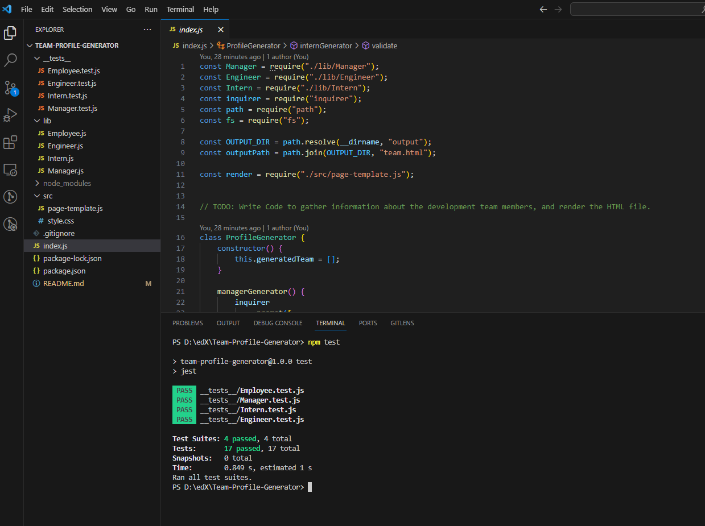

# Team-Profile-Generator

## Description

This is a command-line application that generates a webpage displaying basic information about a software engineering team. It takes input about team members, including managers, engineers, and interns, and creates an HTML webpage with summaries for each person.

## User Story
As a manager, I want to generate a webpage that displays my team's basic info so that I have quick access to their emails and GitHub profiles.

## Installation 
    - Clone or download the starter code provided for this challenge.
    - Install dependencies by running `npm install` in your terminal.

## Usage
    * Run `node index.js` in your terminal to start the application.
    * Follow the prompts to enter information about team members.
    * Choose 'Finish building the team' when done to generate the HTML file.
    * Find the generated HTML file in the output folder.

## GitHub Repository
https://github.com/Yaroslav09/Team-Profile-Generator

## Video link

## Used resources
    - Knowledge received from bootcamp teachers during zoom meeting and code from bootcamp challenge's.
    - inquirer documentation: https://www.npmjs.com/package/inquirer#examples
    - YouTube tutorial: https://www.youtube.com/watch?v=Qf5EXOyGRxw&t=895s    
    - Google search
    - a little bit chatGPT